# YADA — Database Entity Relationship Diagram

The current schema, as defined in
[`App/src/lib/server/db/schema.ts`](../App/src/lib/server/db/schema.ts) and built by the
migrations in [`App/drizzle/`](../App/drizzle) (`0000_init_yada_schema` → `0013_soft_delete_users`).

Postgres, accessed through Drizzle ORM. Authentication tables (`users`, `sessions`,
`accounts`, `verifications`) follow Better Auth's expected shape; everything else is YADA's
own dispatch domain.

## Entity Relationship Diagram

```mermaid
erDiagram
    USERS {
        text id PK "Better Auth id"
        text name "NOT NULL"
        text email UK
        boolean email_verified "NOT NULL, default false"
        text image
        text phone_number UK
        user_role role "NOT NULL, default 'business'"
        timestamptz deleted_at "null while the account is open"
        timestamptz created_at "NOT NULL, default now()"
        timestamptz updated_at "NOT NULL, default now()"
    }

    SESSIONS {
        text id PK
        text user_id FK "NOT NULL, cascade"
        text token UK "NOT NULL"
        timestamptz expires_at "NOT NULL"
        text ip_address
        text user_agent
        timestamptz created_at "NOT NULL, default now()"
        timestamptz updated_at "NOT NULL, default now()"
    }

    ACCOUNTS {
        text id PK
        text user_id FK "NOT NULL, cascade"
        text account_id "NOT NULL"
        text provider_id "NOT NULL"
        text access_token
        text refresh_token
        timestamptz access_token_expires_at
        timestamptz refresh_token_expires_at
        text scope
        text id_token
        text password "hashed credential, null for OAuth links"
        timestamptz created_at "NOT NULL, default now()"
        timestamptz updated_at "NOT NULL, default now()"
    }

    VERIFICATIONS {
        text id PK
        text identifier "NOT NULL, email or phone - not a FK"
        text value "NOT NULL, token"
        timestamptz expires_at "NOT NULL"
        timestamptz created_at "NOT NULL, default now()"
        timestamptz updated_at "NOT NULL, default now()"
    }

    BUSINESS_PROFILES {
        uuid id PK "default gen_random_uuid()"
        text user_id FK,UK "NOT NULL, cascade"
        text business_name "NOT NULL"
        text address "NOT NULL"
        numeric latitude "NOT NULL, (10,6)"
        numeric longitude "NOT NULL, (10,6)"
        numeric rating "NOT NULL, (3,2), default 0.00"
        integer rating_count "NOT NULL, default 0"
        timestamptz updated_at "NOT NULL, default now()"
    }

    COURIER_PROFILES {
        uuid id PK "default gen_random_uuid()"
        text user_id FK,UK "NOT NULL, cascade"
        text vehicle_type "NOT NULL"
        text plate_number "null for riders registered before 0009"
        numeric rating "NOT NULL, (3,2), default 0.00"
        integer rating_count "NOT NULL, default 0"
        boolean active "NOT NULL, default true"
        numeric current_latitude "(10,6)"
        numeric current_longitude "(10,6)"
        timestamptz last_location_at
        timestamptz updated_at "NOT NULL, default now()"
    }

    DELIVERY_REQUESTS {
        uuid id PK "default gen_random_uuid()"
        text business_id FK "NOT NULL, cascade"
        text assigned_courier_id FK "null until accepted, set null"
        trip_status status "NOT NULL, default 'requested'"
        text pickup_address "NOT NULL"
        text dropoff_address "NOT NULL"
        numeric pickup_latitude "(10,6)"
        numeric pickup_longitude "(10,6)"
        numeric dropoff_latitude "(10,6)"
        numeric dropoff_longitude "(10,6)"
        text pickup_place_id
        text dropoff_place_id
        text order_name "NOT NULL, what is being sent"
        numeric order_price "NOT NULL, (10,2), order value in GHS"
        text notes
        numeric estimated_distance_km "(8,2)"
        numeric estimated_duration_minutes "(8,2)"
        timestamptz dispatch_started_at "NOT NULL, the ring clock"
        timestamptz requested_at "NOT NULL, default now()"
        timestamptz accepted_at
        timestamptz completed_at
    }

    TRIP_RATINGS {
        uuid id PK "default gen_random_uuid()"
        uuid trip_id FK "NOT NULL, cascade"
        text rater_id FK "NOT NULL, cascade"
        text rated_id FK "NOT NULL, cascade"
        integer stars "NOT NULL, CHECK 1-5"
        text comment
        timestamptz created_at "NOT NULL, default now()"
    }

    TRIP_DECLINES {
        uuid id PK "default gen_random_uuid()"
        uuid trip_id FK "NOT NULL, cascade"
        text courier_id FK "NOT NULL, cascade"
        timestamptz created_at "NOT NULL, default now()"
    }

    TRIP_EVENTS {
        uuid id PK "default gen_random_uuid()"
        uuid trip_id FK "NOT NULL, cascade"
        text actor_id FK "null for system events, set null"
        text event_type "NOT NULL"
        text payload "JSON as text"
        timestamptz created_at "NOT NULL, default now()"
    }

    %% Identity
    USERS ||--o{ SESSIONS : "signs in through"
    USERS ||--o{ ACCOUNTS : "authenticates with"

    %% Role profiles - at most one of each per user
    USERS ||--o| BUSINESS_PROFILES : "has"
    USERS ||--o| COURIER_PROFILES : "has"

    %% Dispatch
    USERS ||--o{ DELIVERY_REQUESTS : "raises as business"
    USERS ||--o{ DELIVERY_REQUESTS : "carries as courier"
    DELIVERY_REQUESTS ||--o{ TRIP_DECLINES : "was refused in"
    USERS ||--o{ TRIP_DECLINES : "declined"
    DELIVERY_REQUESTS ||--o{ TRIP_EVENTS : "logs"
    USERS ||--o{ TRIP_EVENTS : "acted in"

    %% Reputation
    DELIVERY_REQUESTS ||--o{ TRIP_RATINGS : "is rated on"
    USERS ||--o{ TRIP_RATINGS : "gave"
    USERS ||--o{ TRIP_RATINGS : "received"
```

`VERIFICATIONS` stands alone on purpose: `identifier` holds an email address or phone number
as plain text, so a verification token can be issued before the user row it belongs to is
usable. It is not a foreign key and there is no relationship line to draw.

## Enums

### `user_role`

| Value | Meaning |
| --- | --- |
| `business` | Raises delivery requests. The default for a new account. |
| `courier` | Rides the deliveries. |

There is no `admin`; migration `0004_drop_admin_role` removed it.

### `trip_status`

A trip runs in two phases with an explicit handover between them.

| Value | Phase | Meaning |
| --- | --- | --- |
| `requested` | dispatch | Raised by the business; the expanding ring is looking for a rider. |
| `accepted` | pickup | A courier took the job. |
| `courier_arriving` | pickup | The courier is en route to the pickup. |
| `arrived` | *legacy* | Predates the phase split; kept only so historical rows still read. |
| `picked_up` | handover | The **business** confirmed the parcel changed hands. |
| `in_progress` | delivery | The courier is en route to the drop-off. |
| `completed` | delivery | Delivered. `completed_at` is set. |
| `cancelled` | terminal | Called off by either party. |

## Keys, constraints and indexes

| Table | Constraint | What it protects |
| --- | --- | --- |
| `users` | `users_email_unique`, `users_phone_number_unique` | One account per email, one per phone. |
| `users` | `users_deleted_at_idx` (partial, `WHERE deleted_at IS NOT NULL`) | Cheap lookups of closed accounts without indexing every live row. |
| `sessions` | `sessions_token_unique` | Session tokens are the credential; they cannot collide. |
| `business_profiles` | `business_profiles_user_id_unique` | One business profile per user. |
| `courier_profiles` | `courier_profiles_user_id_unique` (added in `0012`) | One courier profile per rider, so "their position / rating / are they online" has a single answer and `saveCourierProfile` can be a real upsert. |
| `trip_ratings` | `trip_ratings_once_per_rater` on (`trip_id`, `rater_id`) | A second submission for a trip is a conflict, not a louder first one. |
| `trip_ratings` | `trip_ratings_stars_range` `CHECK (stars BETWEEN 1 AND 5)` | Whole stars only, enforced again by the API. |
| `trip_declines` | `trip_declines_once` on (`trip_id`, `courier_id`) | Declining is idempotent; a courier is never ringed twice for the same request. |

### Delete behaviour

Every foreign key cascades from `users` or `delivery_requests` except two, which use
`ON DELETE SET NULL`:

- `delivery_requests.assigned_courier_id` — losing the rider must not erase the delivery.
- `trip_events.actor_id` — the event still happened even if the actor is gone.

Because `delivery_requests.business_id` **does** cascade, closing an account is a soft delete:
`users.deleted_at` is stamped and the credential-bearing fields (password, sessions, email,
phone, image) are stripped, but the row stays so history can still say who sent a parcel.
A non-null `deleted_at` is never cosmetic — the account has no way back in, and any screen
naming that person must mark them closed.

## Design notes

- **Ratings are cached on the profile.** `courier_profiles.rating` / `rating_count` and
  `business_profiles.rating` / `rating_count` are refreshed from the `trip_ratings` aggregate
  whenever a rating lands, so no screen re-aggregates to name a rider or a business. The count
  rides along with the average because an average without its weight cannot be smoothed —
  a lone 5.0 and two hundred of them must not rank the same.
- **`trip_ratings` is direction-agnostic** (`rater_id` → `rated_id`). Only the
  business → courier flow exists today; the courier → business half is the same row with the
  columns swapped, not a second table.
- **Dispatch has no scheduler.** `dispatch_started_at` is the clock: it is set at creation and
  reset by a manual re-ring, and the current ring is always computed from it, never stored.
  `requested_at` stays untouched as history. Declines persist in `trip_declines`, which is what
  keeps a re-ring from offering the job back to someone who already said no.
- **Order details are mandatory.** `order_name` and `order_price` are `NOT NULL`: a delivery
  record that cannot say what was in the parcel is not an audit record. `order_price` is the
  *order's* value in cedis, not a delivery fee — YADA does not price the ride — and it is
  deliberately never sent to the courier app.
- **Coordinates are `numeric(10, 6)`** throughout (~11 cm resolution), not floats, so the
  same position compares equal across the API, the database and the map.
